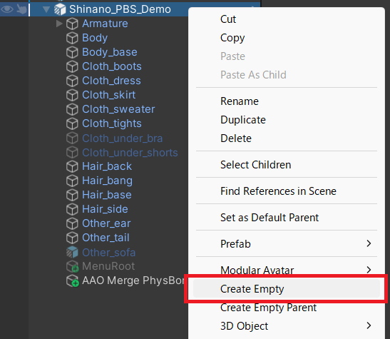
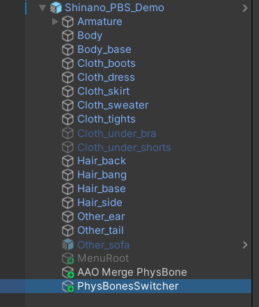
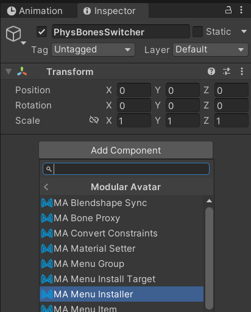
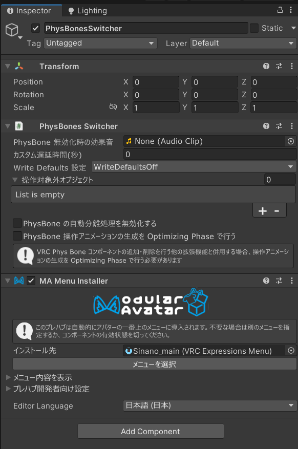
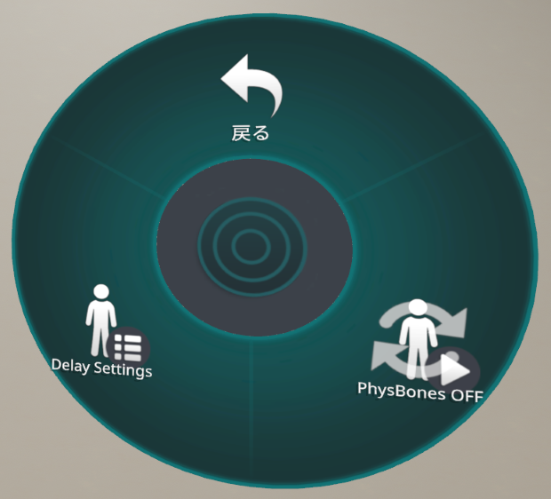

# 基本的な利用方法

## Unity Editor 上での操作

### 注意 (詳しい人向け)

- 本手順は、最小構成で利用する際の手順となります。
- もし既に Modular Avatar の各コンポーネントでメニューが構築されている場合、任意のオブジェクト階層へ空のオブジェクトを作成し、 `PhysBones Swither` コンポーネントを追加すれば動作します。
  - 本コンポーネントは、内部的に `MA Menu Item` コンポーネントを動的生成し、メニュー項目を生成しています。

1. 本コンポーネントを利用したいアバターオブジェクトを右クリックし、コンテキストメニュー項目の `Create Empty` をクリックする

   

2. 空のオブジェクトが追加されるので、好きな名前を付ける

   

   - オブジェクトの名前がメニューでの表示名となります。

3. 追加したオブジェクトの `Add Component` ボタンをクリックし、 `PhysBones Switcher > PhysBones Switcher` の順にクリックし、 `PhysBones Swicher` コンポーネントを追加する

   

4. もう一度 `Add Component` ボタンをクリックし、 `Modular Avatar > MA Menu Installer` の順にクリックし、 `MA Menu Installer` コンポーネントを追加する

   

5. オブジェクトに追加されたコンポーネントが、以下の画像のような形となっていることを確認する

   

   - PhysBones Swither の以下設定項目は任意項目であるため、初期値のままで問題ありません。
     - 無効化時の効果音
     - カスタム遅延時間
     - 操作対象外オブジェクト情報

## VRChat 内での操作

1. メニューを表示し、エクスプレッションメニューを開き、`(追加したオブジェクトの名前) > PhysBone OFF` の順に操作します。 
   以下の画像のような表記になっていれば、PhysBone が無効化されています。

   

   - トグルメニューなので、もう一度 PhysBones OFF ボタンを押せば PhysBone が再度有効化されます。
